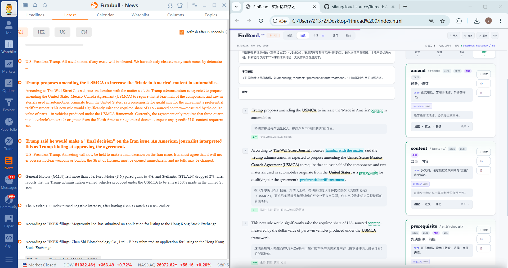

<div align="center">

# 📖 FinRead · 用英文读懂世界

**不只是背单词，而是用英语读懂正在发生的世界。**
*Learn English through real-world news, current affairs, and global issues.*

[](https://silangcloud-source.github.io/finread/)
[](https://silangcloud-source.github.io/finread/)
[](#)

[简体中文](#-中文) · [English](#-english)

</div>

---

## 🌏 中文

### 项目简介

**FinRead** 是一个面向英语学习者的 AI 英语精读工具。

它的核心目标不是让你孤立地背单词，而是帮助你通过**真实英文文章**学习英语，同时关注国家大事、国际局势、经济变化、科技发展和社会议题。

把英文新闻、外刊文章、国际评论、政策材料或任何英文内容粘贴进 FinRead，借助 AI 辅助翻译、查词、精读和复习，把一篇真实文章转化为：

- 📘 可理解的精读材料
- 🗂️ 可积累的词汇卡片
- 🔁 可复习的学习任务
- 🌱 可长期沉淀的英语知识

> FinRead 关注的不只是「学英语」，而是 **用英语接触真实世界，用阅读积累语言能力。**

### 💡 为什么做 FinRead？

很多英语学习者的问题不是不努力，而是学习方式长期脱离真实语境：

- 背了很多单词，却读不懂真实英文新闻
- 看外刊时频繁查词，阅读被不断打断
- 翻译软件只给结果，不帮你真正理解句子
- 英语学习停留在教材、题目和单词表里
- 想关注国际局势，却缺少英文原始材料的阅读能力
- 读完文章后，生词、表达和句子没有被系统整理
- 背单词和真实阅读之间没有形成连接

**FinRead 想解决的，是让英语学习走出考试和单词表，进入真实世界。**

通过阅读英文新闻、外刊和时事文章，你可以同时提升：英语阅读能力 · 词汇理解 · 长难句分析 · 信息获取 · 国际视野 · 对现实世界的理解。

### 🧭 核心理念

> 每天读一篇真实英文文章，积累词汇，理解表达，关注世界。

FinRead 不是单纯的翻译工具，也不是传统背单词软件，而是一个把真实英文材料**转化为学习资产**的工具：

```text
真实英文文章 → AI 辅助理解 → 生词沉淀 → 复习巩固 → 长期积累
```

### ✨ 主要功能

| 功能 | 说明 |
| --- | --- |
| 📋 粘贴即读 | 直接粘贴任意英文文本，立即开始精读 |
| 🔍 划词查词 | 选中单词或短语，即时显示释义、音标与例句 |
| 🤖 AI 翻译 | 整段或逐句翻译，对照理解长难句 |
| 🔊 朗读发音 | 单词与句子语音朗读，辅助听力与跟读 |
| 🗂️ 生词与掌握度 | 标记生词、记录掌握程度，按需复习巩固 |
| 📴 离线运行 | 核心界面为单个 HTML 文件，下载后可离线打开 |
| 🔒 本地存储 | 数据保存在你自己的浏览器中，隐私可控 |
| 🧩 多模型支持 | 可配置 DeepSeek、Gemini 等 AI 接口 |

### 🚀 使用方法

1. 打开 **[在线地址](https://silangcloud-source.github.io/finread/)**，或下载 `index.html` 双击在浏览器打开。
2. 在设置中填入你的 **AI API Key**（如 DeepSeek / Gemini）。
3. 粘贴英文文章，开始精读、查词、翻译与复习。

> 🔐 AI 相关功能需要你自己的 API Key。密钥仅保存在本地浏览器，不会上传。

---

## 🌏 English

### Overview

**FinRead** is an AI-powered English intensive-reading tool for learners.

Its goal isn't to make you memorize words in isolation — it's to help you learn English through **real-world articles** while staying engaged with current affairs, geopolitics, the economy, technology, and society.

Paste news, magazine pieces, international commentary, policy texts, or any English content into FinRead. With AI-assisted translation, lookup, close reading, and review, a real article becomes:

- 📘 Readable, understandable material
- 🗂️ Reusable vocabulary cards
- 🔁 Reviewable study tasks
- 🌱 Lasting English knowledge

> FinRead is not just about *learning English* — it's about **using English to engage with the real world, and building language ability through reading.**

### 💡 Why FinRead?

For many learners the problem isn't effort — it's that their study is disconnected from real context:

- Memorized lots of words, yet can't read real English news
- Constant dictionary lookups break the flow of reading
- Translation apps give answers but don't build understanding
- Learning stays trapped in textbooks, quizzes, and word lists
- Want to follow world affairs, but can't read the original English sources
- After reading, new words and expressions are never organized
- No bridge between rote vocabulary and real reading

**FinRead bridges that gap — moving English study out of the exam room and into the real world.**

By reading English news and current-affairs articles, you simultaneously grow: reading ability · vocabulary · complex-sentence parsing · information literacy · a global perspective.

### 🧭 Philosophy

> Read one real English article every day — collect words, understand expressions, follow the world.

FinRead is neither a plain translator nor a traditional flashcard app. It turns real English material **into learning assets**:

```text
Real article → AI-assisted understanding → Word collection → Review → Long-term growth
```

### ✨ Features

| Feature | What it does |
| --- | --- |
| 📋 Paste & read | Drop in any English text and start reading instantly |
| 🔍 Click-to-lookup | Select a word or phrase for definitions, phonetics, examples |
| 🤖 AI translation | Translate whole passages or sentence by sentence |
| 🔊 Text-to-speech | Read words and sentences aloud for listening practice |
| 🗂️ Vocabulary & mastery | Flag new words, track mastery, review as needed |
| 📴 Works offline | The core app is a single HTML file — open it without internet |
| 🔒 Local storage | Your data stays in your own browser |
| 🧩 Multiple AI models | Configure providers such as DeepSeek and Gemini |

### 🚀 Getting started

1. Open the **[live site](https://silangcloud-source.github.io/finread/)**, or download `index.html` and open it in your browser.
2. Enter your **AI API Key** (e.g. DeepSeek / Gemini) in the settings.
3. Paste an English article and start reading, looking up words, translating, and reviewing.

> 🔐 AI features require your own API key. The key is stored only in your local browser and is never uploaded.

---

<div align="center">

### 🖼️ 界面预览 / Screenshot



<sub>左：真实英文财经新闻　|　中：逐句精读与翻译　|　右：自动生成的生词卡片<br>Left: real financial news　|　Center: sentence-by-sentence reading & translation　|　Right: auto-generated word cards</sub>

---

**个人学习项目，欢迎自用于英语学习。**
*A personal study project — feel free to use it for your own English learning.*

⭐ 如果对你有帮助，欢迎 Star / If it helps you, a star is welcome ⭐

</div>
